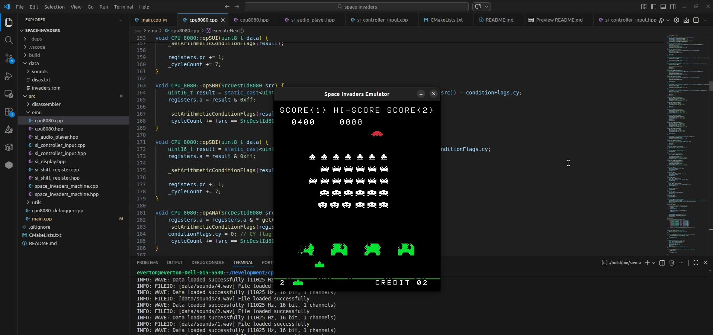

# Space Invaders Emulator



A space invaders arcade machine emulator written in C++ using [Raylib](https://www.raylib.com/) for rendering and audio handling. This project emulates the Intel 8080 CPU and the original arcade hardware.

## Features

- Complete Intel 8080 CPU emulation.
- Original arcade graphics and sounds.
- Support for 1 and 2 players.
- Debugging tools included (CLI debugger and disassembler).

## Installation

Download the latest release from [GitHub Releases](https://github.com/Everton-Colombo/space-invaders/releases) and execute the appropriate executable for your platform (Linux 64-bit or Windows 64-bit).

## Building

### Prerequisites

To build this project, you will need:
- A C++17 compatible compiler (GCC, Clang, MSVC).
- [CMake](https://cmake.org/) (version 3.25 or higher).
- [Git](https://git-scm.com/) (to fetch dependencies).

### Building instructions

The project uses CMake for the build system. Raylib is automatically fetched as a dependency during configuration.

1. Clone the repository:
   ```bash
   git clone <repository-url>
   cd space-invaders
   ```

2. Create a build directory and configure the project:
   ```bash
   mkdir build
   cd build
   cmake ..
   ```

3. Compile the project:
   ```bash
   cmake --build .
   ```

## Running the Emulator

After a successful build, the executable will be located in the `bin` directory inside your build folder. The game assets (`data` folder) are automatically copied to the binary location.

```bash
./bin/siemu
```

## Controls

### General
| Action | Key |
|--------|-----|
| Insert Coin | **C** |

### Player 1
| Action | Key |
|--------|-----|
| Start Game | **Enter** |
| Move Left | **A** |
| Move Right | **D** |
| Shoot | **W** |

### Player 2
| Action | Key |
|--------|-----|
| Start Game | **Space** |
| Move Left | **Left Arrow** |
| Move Right | **Right Arrow** |
| Shoot | **Up Arrow** |

## Project Structure

- `src/emu`: Core emulator components (CPU, Memory, Shift Register).
- `src/disassembler`: Intel 8080 disassembler library.
- `src/utils`: Utility functions.
- `src/main.cpp`: Main entry point and Raylib integration.
- `data`: ROM files and sound assets.

## Additional Tools

The build process also generates two additional tools in the `bin` folder:
- `8080_disassembler`: A standalone disassembler for 8080 ROMs.
- `cpu8080_debugger`: A CLI-based debugger for the CPU emulator.
